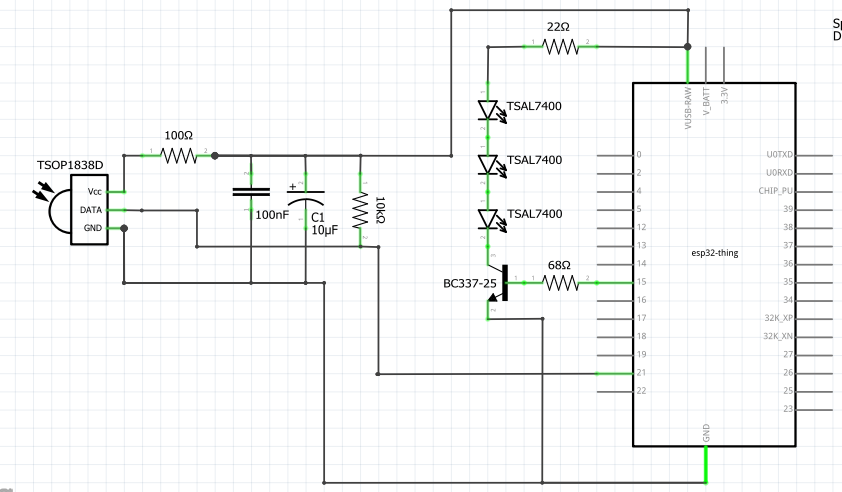

# Module IR TX RX

This module was created to be used in the [main project](https://github.com/andreyuki/airconditioner-remotecontrol-main).

It uses the RMT peripheral of the Sparkfun ESP32 to send and receive infrared signal.

### Schematics

For receiving the infrared signal the following are used: an infrared sensor led (TSOP1838D), a 10uF and a 100nF capacitor, a 100 Ohm resistor and a 10k Ohm.

For sending the infrared signal the following are used: 3 infrared emitter led (TSAL7300), one NPN transistor (BC337-25), one 22 Ohm resistor and one 68 Ohm



The capacitors and resistors are used to decrease the noise on the sensor and the transistor is to increase the current in the emitters.

The sensor is using port 21 and emitter port 15.

### Receive commands

The receive_commands function is this module interface to receive commands. It receives the command's information, put it in a struct and creat a RMT task (rmt_rx_receive_command) to receive the infrared signal.

But before calling the receive_commands, it is necessary to initalize the rmt using the function:

```C
void rx_channels_init(rmt_channel_t rmt_rx_channel, int rx_gpio, int rx_mem_block_num) {

	rmt_config_t rmt_rx_config;

	rmt_rx_config.rmt_mode      = RMT_MODE_RX;
	rmt_rx_config.channel       = rmt_rx_channel;
	rmt_rx_config.gpio_num      = rx_gpio;
	rmt_rx_config.clk_div       = 80;
	rmt_rx_config.mem_block_num = rx_mem_block_num;

	rmt_rx_config.rx_config.filter_en           = false;
	rmt_rx_config.rx_config.filter_ticks_thresh = 0;
	rmt_rx_config.rx_config.idle_threshold      = 50000;

	rmt_config(&rmt_rx_config);
	rmt_driver_install(rmt_rx_config.channel, 1024, 0);
}
```

It uses a EventGroup to wait the task to return the command struct so it can end the receive_command functon properly.

```C
commands receive_commands(char* brand, char* model, char* func) {
	commands command;

	xEventGroup = xEventGroupCreate();

	snprintf(command.brand, COMMAND_STRUCT_STRING_LENGTH, "%s", brand);
	snprintf(command.model, COMMAND_STRUCT_STRING_LENGTH, "%s",  model);
	snprintf(command.func, COMMAND_STRUCT_STRING_LENGTH, "%s", func);

	xTaskCreate(rmt_rx_receive_command, "rmt_rx_receive_command", 2048, (void*)&command, 10, NULL);

	xEventGroupWaitBits(xEventGroup, BIT0, pdFALSE, pdFALSE, portMAX_DELAY);

	return command;

}
```

### Send commands

It is very similar to the receive commands. There is a function that is the module interface that receives the items to send as parameters and create a RMT task that sends the infrared signal.

```C
esp_err_t send_commands(rmt_items* items) {
	esp_err_t ret = ESP_OK;

	if(xTaskCreate(rmt_tx_task, "rmt_tx_task", 2048, (void *) items, 10, NULL) != pdPASS){
		ret = ESP_ERR_NO_MEM;
	}

	return ret;
}
```

There is a difference in the inialization, most of the air conditioner remote control use a 38kHz carrier, so we have to set it up.

```C
    rmt_tx_config.tx_config.carrier_freq_hz = 38000;
```

Other difference is that we use a semaphore to prevent two tasks using the hardware simultaneosly.


